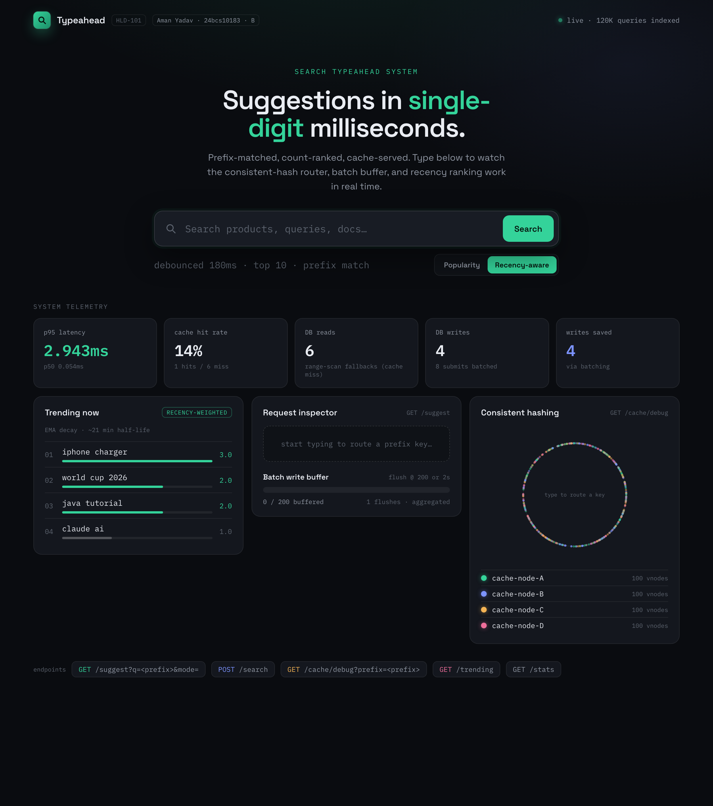
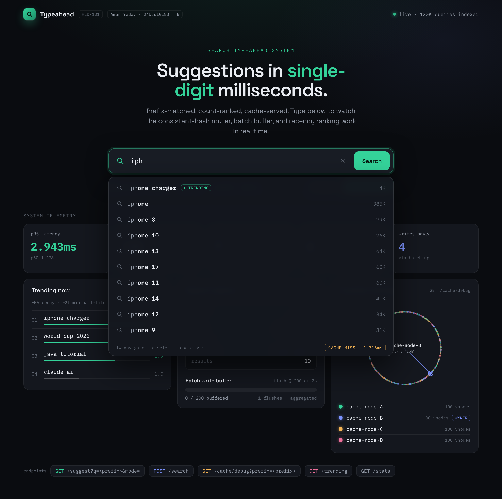

# Search Typeahead System

**Aman Yadav** · Roll No. **24bcs10183** · Class **B** · 2nd Year
HLD101 Assignment — **SST-2028**




A backend-heavy search typeahead (Google/Amazon-style suggestion) system with:

- **Approach 2 (Hashmap / Key-Value)** — *no trie.* Suggestions are served from a `prefix → top-10` cache; a miss falls back to a **prefix range scan** of the primary frequency DB → sub-millisecond suggestions
- **Distributed LRU cache** across 4 logical nodes routed via **consistent hashing** (100 vnodes/node)
- **Recency-aware ranking** using exponentially-decayed search-rate (EMA) blended with all-time popularity
- **Batched, asynchronous writes** to SQLite — repeated searches collapse into a single row update
- **Trending searches** endpoint + UI section
- A clean dark-themed frontend with debouncing, keyboard navigation, and a live metrics panel

## Measured performance (3,000 requests, local laptop)

```
p50: 0.26ms   p95: 0.28ms   p99: 0.33ms
cache hit-rate: 97.1%   (warm)
write reduction (search events / DB row writes): observed 1.6× on demo traffic,
   grows linearly with query repetition — see DESIGN.md §6.
```

## Quick start

```bash
cd search-typeahead
python3.12 -m venv .venv
.venv/bin/pip install -r requirements.txt

# Generate the 120k-query dataset on first run (auto-creates if missing)
cd backend
../.venv/bin/uvicorn main:app --host 127.0.0.1 --port 8765
```

Open <http://127.0.0.1:8765/> in the browser.

### Tests

With the server running, the end-to-end suite asserts every functional
requirement (§4–§8) plus the API/validation fixes:

```bash
cd backend
../.venv/bin/python test_e2e.py    # 33 checks; exits non-zero on any failure
```

Latest run: **33 passed, 0 failed** — prefix matching, ≤10 count-sorted
suggestions, empty/mixed-case/no-match handling, new-query insert +
existing-count increment, popularity↔recency divergence, trending,
cache hit/miss + fallback, consistent-hash spread, batch write-reduction,
the error envelope, and `mode` validation.

### Run with Docker

The app is a single self-contained service (FastAPI serving the API +
static frontend; the 120k synthetic dataset is baked into the image, so
no network is needed at runtime).

```bash
cd search-typeahead
docker compose up --build        # → http://localhost:8765/
# or plain docker:
docker build -t search-typeahead .
docker run -p 8765:8765 search-typeahead
```

Image details (follows `guidelines/docker_best_practices.md`): multi-stage
build, `python:3.12-slim` base, **non-root** user, stdlib `/health`
HEALTHCHECK, logs to stdout, graceful SIGTERM shutdown (drains the batch
buffer). Final image ~264 MB. To use a real dataset instead of the baked
synthetic one, mount it: `-v /path/to/data:/app/data` (with a
`queries.csv` inside).

## Dataset

- **Format:** `data/queries.csv`, two columns `query,count` (header optional),
  matching the assignment's expected input format.
- **Source (default):** a **synthetic** dataset of **120,000** queries is
  generated on first boot by [`backend/data_loader.py`](backend/data_loader.py)
  (`_synthesize_dataset`). It mixes realistic e-commerce / how-to / tutorial /
  news / places queries with a **Zipfian** count distribution (a few very
  popular queries, a long tail of rare ones) — the same shape as real search
  traffic. It is seeded (`Random(42)`), so every run produces the same data.
  This satisfies §3 (≥100k queries, with counts).
- **Using a real open-source dataset instead:** drop any CSV with the
  `query,count` columns at `data/queries.csv` before first boot and it will be
  loaded as-is (the synthesizer only runs when the file is missing). Good
  sources: AOL search logs, Google Trends exports, Wikipedia page titles +
  pageview counts, or an Amazon product-title dump. If your file has no counts,
  aggregate to derive them (the loader expects them pre-aggregated).

## API surface

| Method | Path | Purpose |
| --- | --- | --- |
| GET | `/suggest?q=<prefix>&mode=<popularity\|recency>` | Top-10 matching suggestions (suggestion-cache → frequency-DB range-scan fallback). `mode` toggles all-time popularity vs. recency-aware ranking. Returns the routed `cache_node`, hit/miss `source`, and per-item `count`. |
| POST | `/search` `{query}` | Dummy "Searched" response + records the query |
| GET | `/trending` | Top-10 currently-trending queries (EMA-decayed) |
| GET | `/cache/debug?prefix=<p>` | Which cache shard owns this prefix, hit/miss status, ring position |
| GET | `/ring` | Full virtual-node ring layout + prefix distribution across shards |
| GET | `/stats` | p50/p95/p99 latency, hit rates, batch metrics, DB stats |

The frontend is an **engineering console** (dark, Space Grotesk + IBM Plex Mono) that
surfaces every system internal live: a popularity↔recency toggle, the per-request cache
hit/miss + routed node inspector, the batch-buffer fill gauge, telemetry tiles, and a
real consistent-hash ring SVG drawn from the actual virtual-node positions.

## Repository layout

```
search-typeahead/
├── backend/
│   ├── main.py              FastAPI app, routes
│   ├── db.py                Frequency DB (primary store) + prefix range-scan fallback — no trie
│   ├── cache.py             Top-Suggestions cache: LRU shards + distributed wrapper
│   ├── consistent_hash.py   Hash ring with virtual nodes
│   ├── batch_writer.py      Async buffer → batched DB flushes
│   ├── trending.py          EMA-decayed recency tracker
│   ├── data_loader.py       CSV ingestion + synthetic generator
│   └── bench.py             Tiny load-test script
├── frontend/                index.html + style.css + app.js
├── data/                    queries.csv + typeahead.db (generated)
└── docs/
    ├── DESIGN.md            Architecture, choices, trade-offs
    ├── PERFORMANCE.md       Latency / hit-rate / write-reduction report
    ├── VIVA.md              Likely viva questions + answers
    └── WALKTHROUGH.md       Code-walkthrough commentary
```

**📄 [docs/PROJECT_REPORT.md](docs/PROJECT_REPORT.md) — the consolidated
submission report** (architecture, dataset, API docs, design choices &
trade-offs, performance).

Deeper write-ups: [docs/DESIGN.md](docs/DESIGN.md) for the architecture
detail, [docs/WALKTHROUGH.md](docs/WALKTHROUGH.md) for a guided code tour,
[docs/PERFORMANCE.md](docs/PERFORMANCE.md) for the full performance
report, and [docs/VIVA.md](docs/VIVA.md) for viva prep questions.
